---
## Front matter
lang: ru-RU
title: Презентация по лабораторной работе №1
subtitle: Основы информационной безопасности
author:
  - Курилко-Рюмин Е.М
institute:
  - Российский университет дружбы народов, Москва, Россия
date: 22 февраля 2025

## i18n babel
babel-lang: russian
babel-otherlangs: english

## Fonts
mainfont: PT Serif
romanfont: PT Serif
sansfont: PT Sans
monofont: PT Mono
mainfontoptions: Ligatures=TeX
romanfontoptions: Ligatures=TeX
sansfontoptions: Ligatures=TeX,Scale=MatchLowercase
monofontoptions: Scale=MatchLowercase,Scale=0.9

## Formatting pdf
toc: false
toc-title: Содержание
slide_level: 2
aspectratio: 169
section-titles: true
theme: metropolis
header-includes:
 - \metroset{progressbar=frametitle,sectionpage=progressbar,numbering=fraction}
 - '\makeatletter'
 - '\beamer@ignorenonframefalse'
 - '\makeatother'
---

# Информация

## Докладчик

:::::::::::::: {.columns align=center}
::: {.column width="70%"}

  * Курилко-Рюмин Евгений Михайлович
  * студент группы НКАбд-02-23
  * Российский университет дружбы народов

:::
::: {.column width="30%"}

:::
::::::::::::::

## Цель

Целью данной работы является приобретение практических навыков
установки операционной системы на виртуальную машину, настройки ми-
нимально необходимых для дальнейшей работы сервисов.

## Задание

1. Установка и настройка операционной системы.
2. Найти следующую информацию:
	1. Версия ядра Linux (Linux version).
	2. Частота процессора (Detected Mhz processor).
	3. Модель процессора (CPU0).
	4. Объем доступной оперативной памяти (Memory available).
	5. Тип обнаруженного гипервизора (Hypervisor detected).
	6. Тип файловой системы корневого раздела.

## Выполнение лабораторной работы

Я выполняю лабораторную работу на домашнем оборудовании, поэтому создаю новую виртуальную машину в VirtualBox, выбираю имя, местоположение  и образ ISO, устанавливать будем операционную систему Rocky DVD

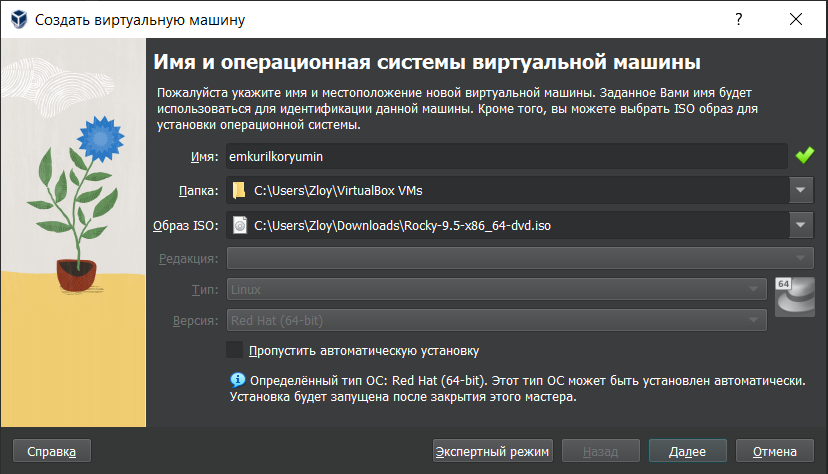

## Соглашаюсь с проставленными настройками

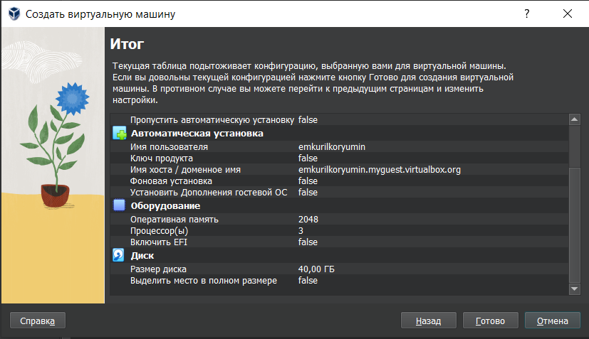

## Начинается загрузка операционной системы 

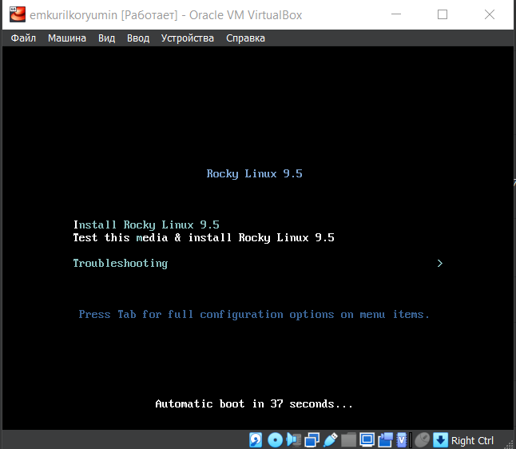

## При этом должен быть подключен в носителях образ диска!

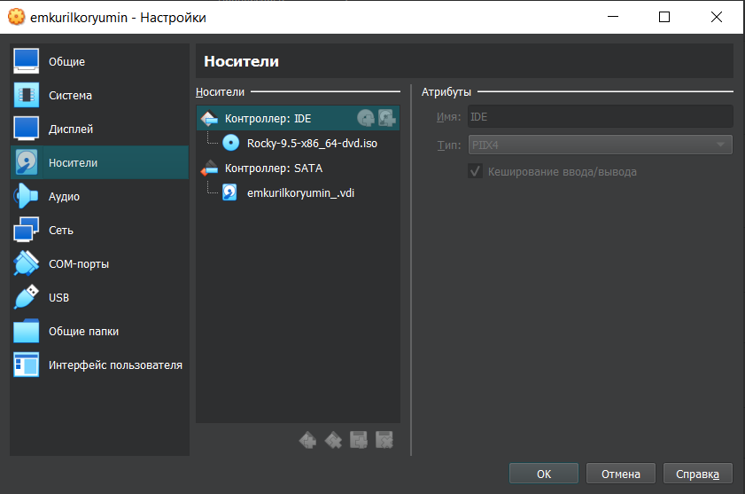

## В обзоре установки будем проверять все настройки и менять на нужные 

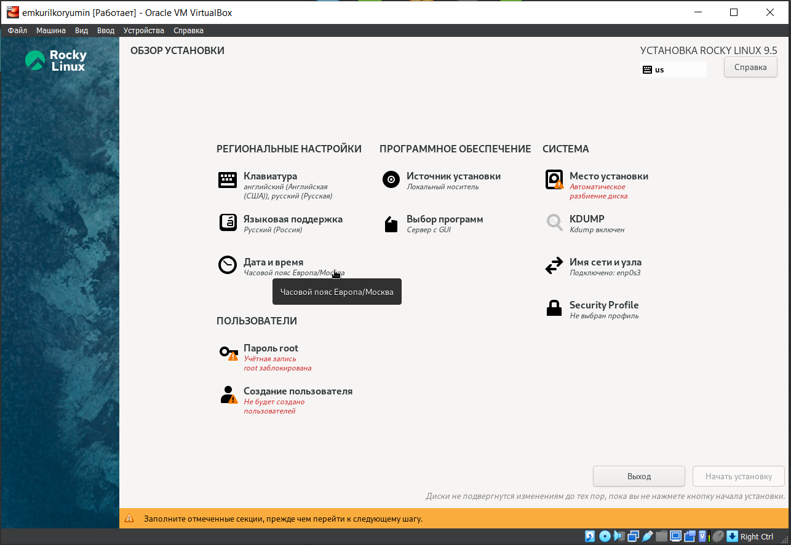

## Начало установки 

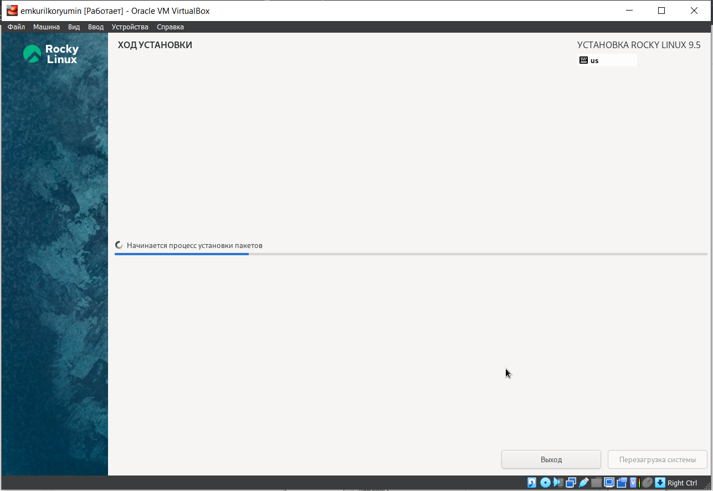

## После завершения установки образ диска сам пропадет из носителей 

##После установки при запуске операционной системы появляется окно выбора пользователя 

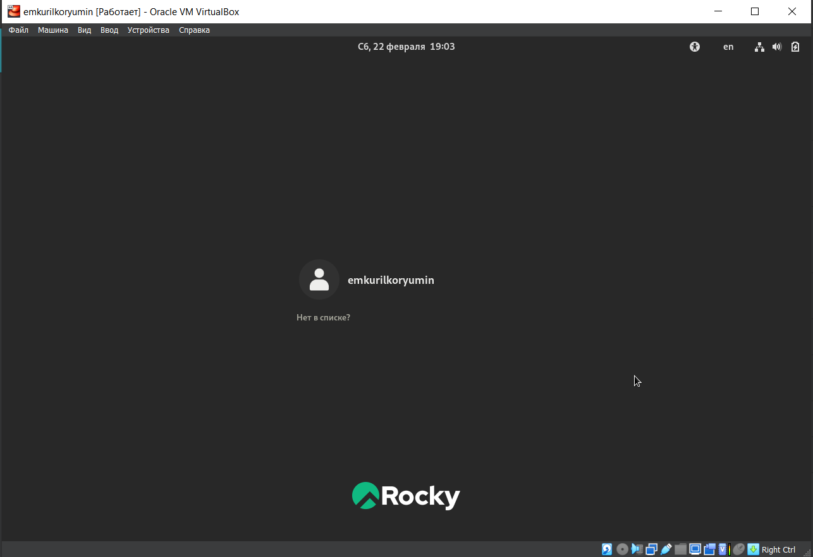

## 1

Версия ядра 5.14.0-503.14.1.el9_5.x86_64 

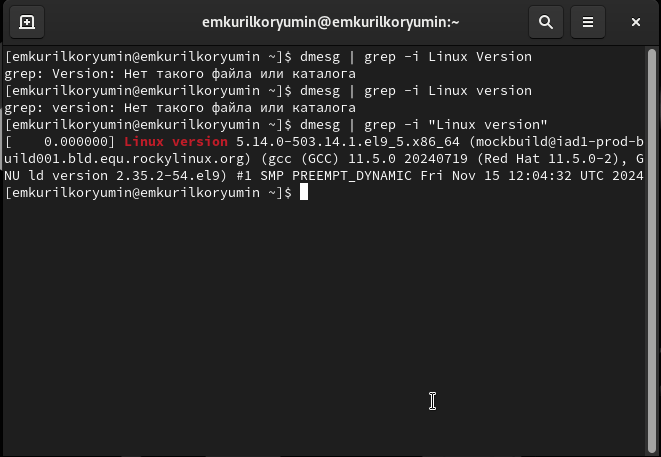

## 2

Частота процессора 3110 МГц 

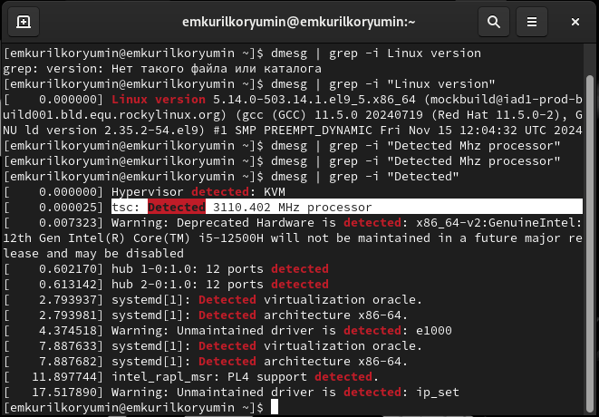

## 3

Модель процессора Intel Core i5-12500U 

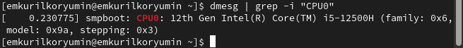

## 4

Доступно 260860 Кб из 2096696 Кб 

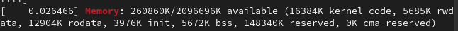

## 5

Обнаруженный гипервизор типа KVM 

## 6

sudo fdish -l показывает тип файловой системы, типа Linux, Linux LVM 

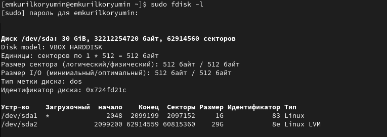

## 7

Далее показана последовательно монтирования файловых систем 

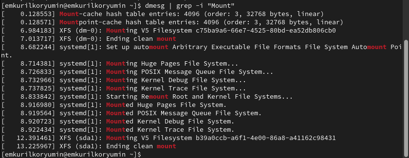

## Вывод

я получил практические навыки по установке операционной системы на виртуальную машину, настройки необходимых для работы сервисов.

:::
