---
## Front matter
lang: ru-RU
title: Презентация по выполнению индивидуального проекта №1
subtitle: Основы информационной безопасности
author:
  - Курилко-Рюмин Е.М
institute:
  - Российский университет дружбы народов, Москва, Россия
date: 8 марта 2025

## i18n babel
babel-lang: russian
babel-otherlangs: english

## Fonts
mainfont: PT Serif
romanfont: PT Serif
sansfont: PT Sans
monofont: PT Mono
mainfontoptions: Ligatures=TeX
romanfontoptions: Ligatures=TeX
sansfontoptions: Ligatures=TeX,Scale=MatchLowercase
monofontoptions: Scale=MatchLowercase,Scale=0.9

## Formatting pdf
toc: false
toc-title: Содержание
slide_level: 2
aspectratio: 169
section-titles: true
theme: metropolis
header-includes:
 - \metroset{progressbar=frametitle,sectionpage=progressbar,numbering=fraction}
 - '\makeatletter'
 - '\beamer@ignorenonframefalse'
 - '\makeatother'
---

# Информация

## Докладчик

:::::::::::::: {.columns align=center}
::: {.column width="70%"}

  * Курилко-Рюмин Е.М
  * студент группы НКАбд-02-23
  * Российский университет дружбы народов
 

:::
::: {.column width="30%"}

:::
::::::::::::::

## Цель

Приобретение практических навыков по установке операционной системы Linux на виртуальную машину.

- Необходимо установить дистрибутив Kali Linux на виртуальную машину VirtualBox.

# Выполнение первого этапа проекта

## Создание виртуальной машины

Открываю VirtualBox, нажимаю `создать`, в появившемся окне выбираю тип операционной системы Linux, версия - Debian, задаю имя машины 

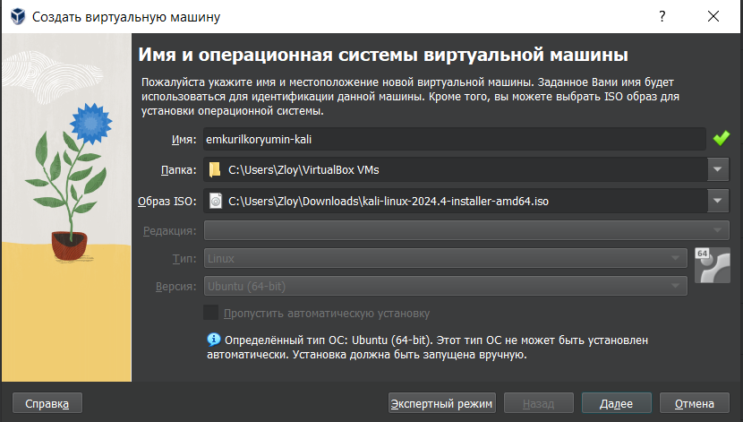

## Создание виртуальной машины

Соглашаюсь с получившимися характеристиками, жму `готово` 
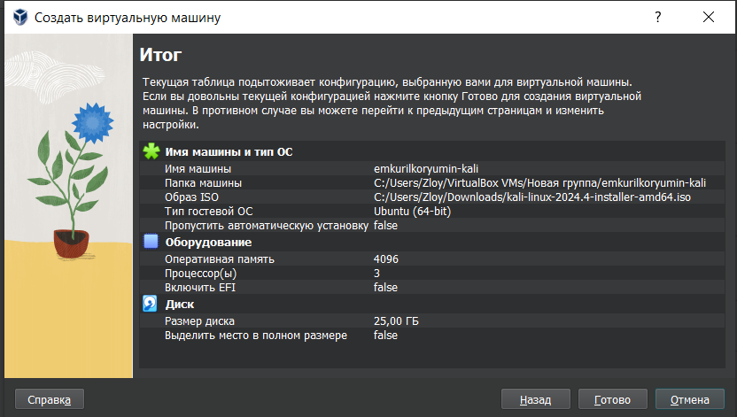

## Создание виртуальной машины

Подключаю ранее скачанный образ диска 

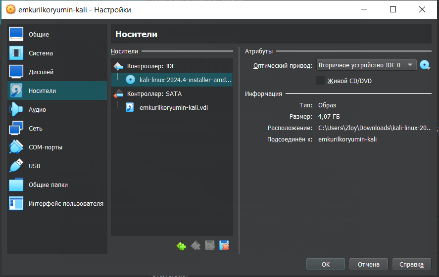

## Установка операционной системы на виртуальную машину

В окне установки Kali выбираю графическую установку 

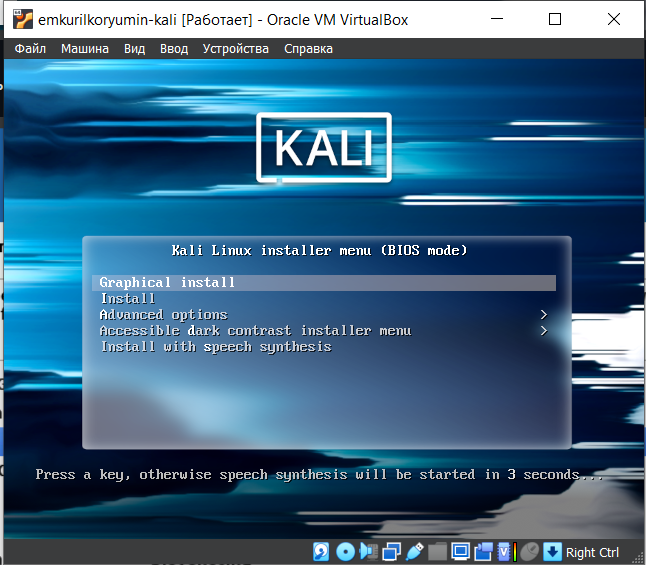

## Настройка имени компьютера

Ввожу имя компьютера 

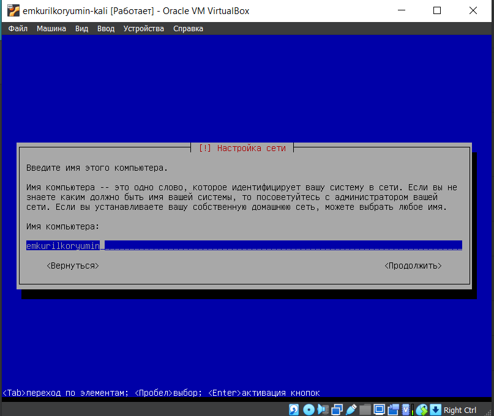

## Настройка пользователей

Ввожу имя пользователя, у которой будут права суперпользователя 

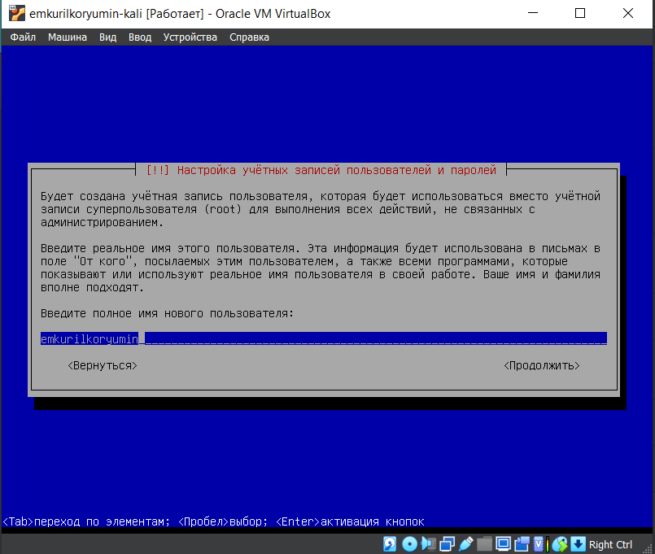

## Разметка дисков

Теперь установщик проверяет диски и предлагает различные варианты,
в зависимости от настроек. 

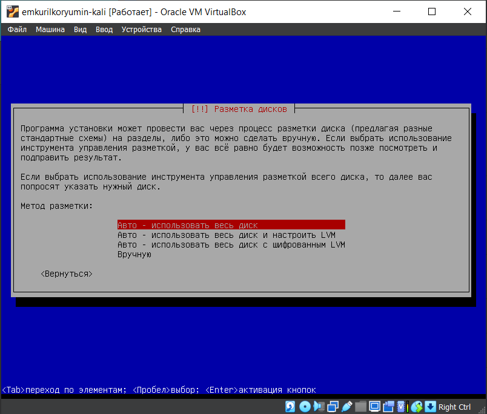

## Разметка дисков

Убеждаюсь, что выбран нужный виртуальный диск, продолжаю
настройку разметки дисков 

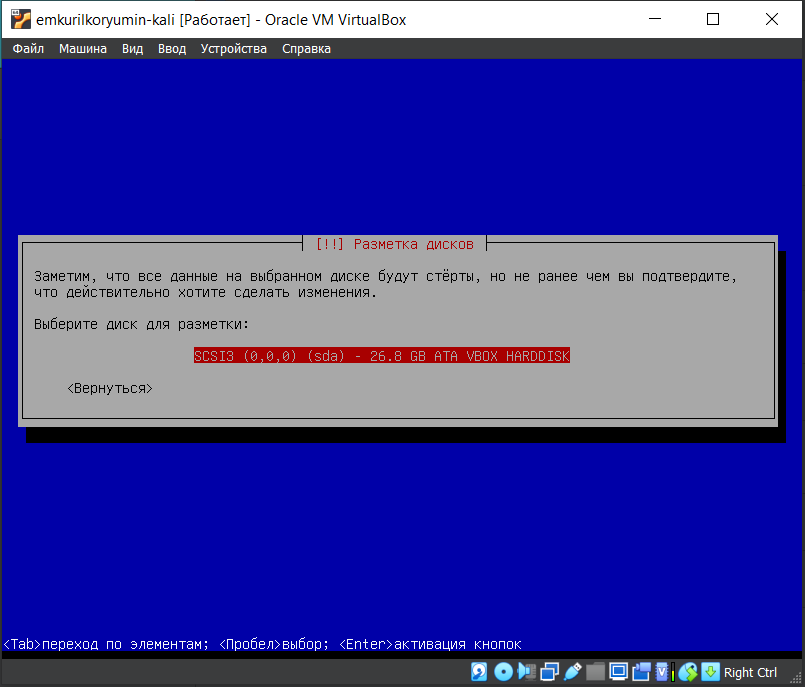

## Разметка дисков

После этого этапа надо подтвердить
окончание разметки дисков, чтобы изменения были записаны 

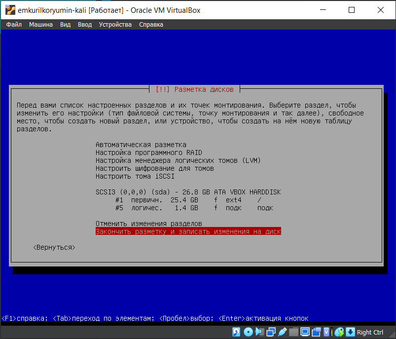

## Установка метапакетов

Далее я могу выбрать, какие метапакеты (пустые пакеты, которые
только описывают зависимости) я хотите установить. Выбор по
умолчанию установит стандартную систему Kali Linux, поэтому я не хочу
менять выбор 

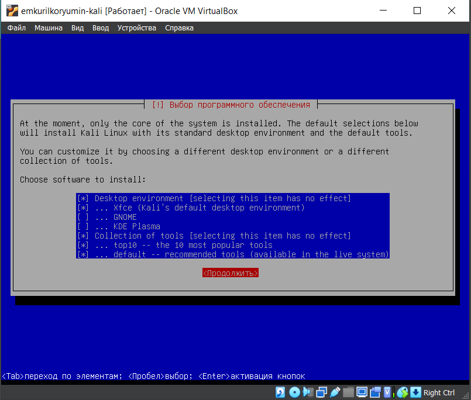

## Установка системного загрузчика

Подтверждаю установку системного загрузчика GRUB (Загрузчик
операционной системы от проекта GNU программа для управления
процессом загрузки), также выбираю виртуальный диск, на который
устанавливать GRUB  

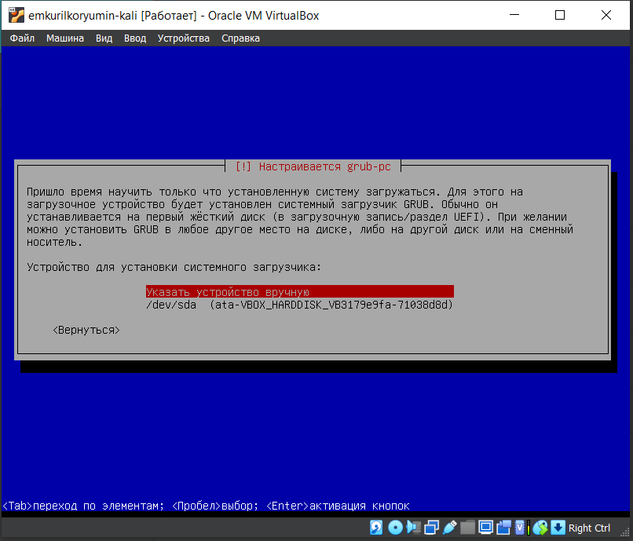

## Завершение установки

Завершаю установку

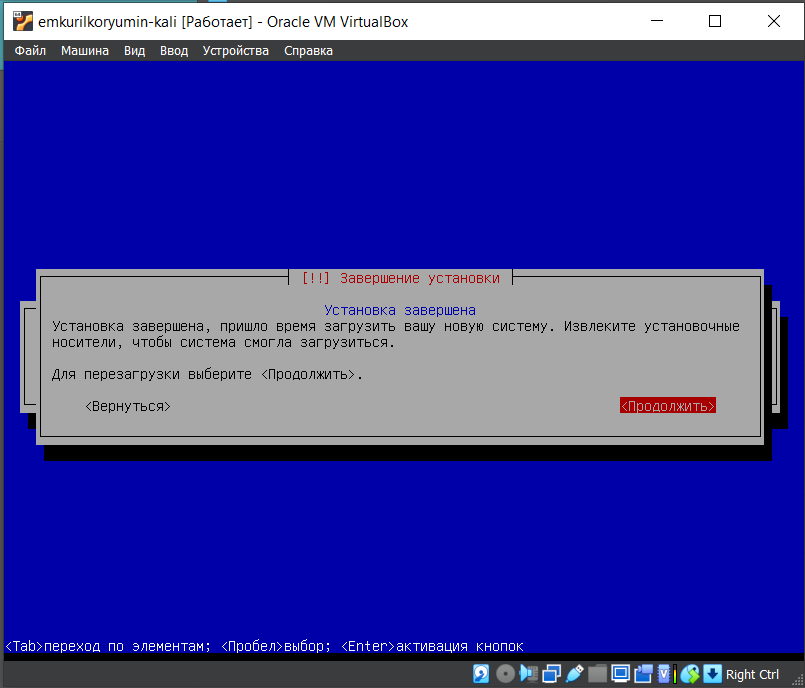

##

Проверяю, что в носителях теперь пусто 

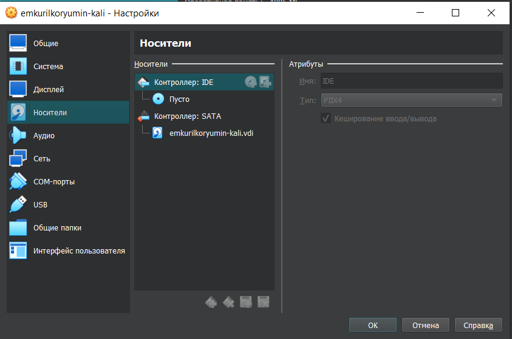

## Вход в систему

Вход в систему выполнен успешно, как и ее загрузка 

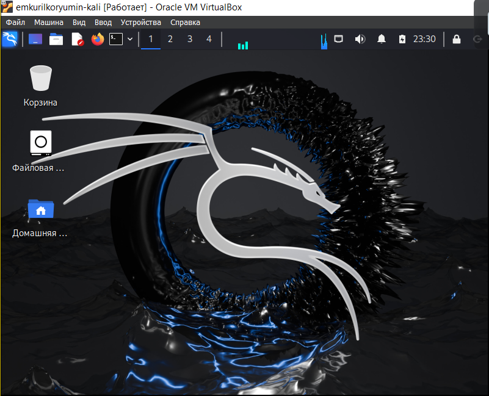

## Вывод

Приобрел практические навыки по установке операционной системы Linux на виртуальную машину.

:::

