---
## Front matter
lang: ru-RU
title: Презентация по выполнению индивидуального проекта №2
subtitle: Основы информационной безопасности
author:
  - Курилко-Рюмин Е.М
institute:
  - Российский университет дружбы народов, Москва, Россия
date: 22 марта 2025

## i18n babel
babel-lang: russian
babel-otherlangs: english

## Fonts
mainfont: PT Serif
romanfont: PT Serif
sansfont: PT Sans
monofont: PT Mono
mainfontoptions: Ligatures=TeX
romanfontoptions: Ligatures=TeX
sansfontoptions: Ligatures=TeX,Scale=MatchLowercase
monofontoptions: Scale=MatchLowercase,Scale=0.9

## Formatting pdf
toc: false
toc-title: Содержание
slide_level: 2
aspectratio: 169
section-titles: true
theme: metropolis
header-includes:
 - \metroset{progressbar=frametitle,sectionpage=progressbar,numbering=fraction}
 - '\makeatletter'
 - '\beamer@ignorenonframefalse'
 - '\makeatother'
---

# Информация

## Докладчик

:::::::::::::: {.columns align=center}
::: {.column width="70%"}

  * Курилко-Рюмин Е.М
  * студент группы НКАбд-02-23
  * Российский университет дружбы народов

:::
::: {.column width="30%"}

:::
::::::::::::::

## Цель

Приобретение практических навыков по установке DVWA.

# Выполнение лабораторной работы

## 1.1

Настройка DVWA происходит на нашем локальном хосте, поэтому нужно перейти в директорию `/var/www/html`. Затем клонирую нужный репозиторий GitHub

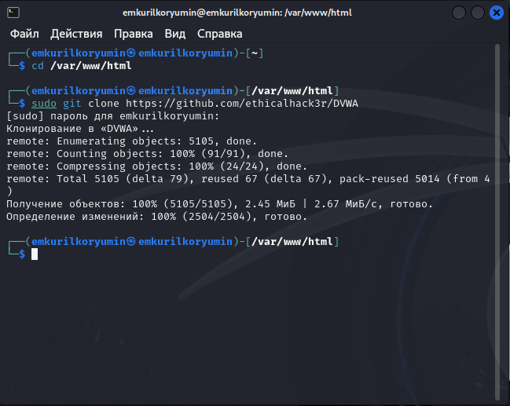

## 1.2

Повышаю права доступа к этой папке до 777

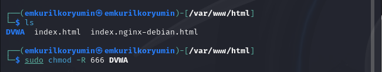

## 1.3

Чтобы настроить DVWA, нужно перейти в каталог `/dvwa/config` 

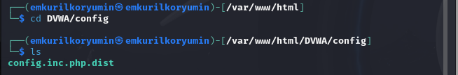

## 1.4

Создаем копию файла, используемого для настройки DVWA `config.inc.php.dist` с именем `config.inc.php`.

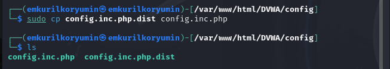

## 1.5

Изменяю данные об имени пользователя и пароле

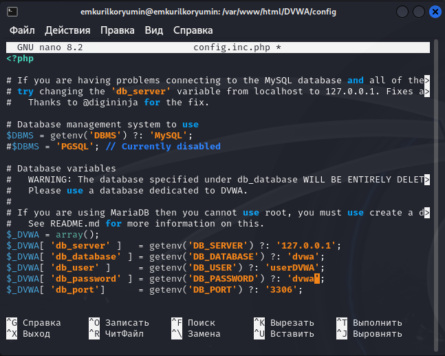

## 2.1

Запускаю mysql

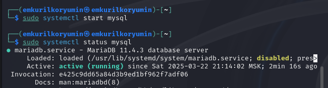

## 2.2

Авторизируюсь в базе данных от имени пользователя root. Создаем нового пользователя, используя учетные данные из файла config.inc.php

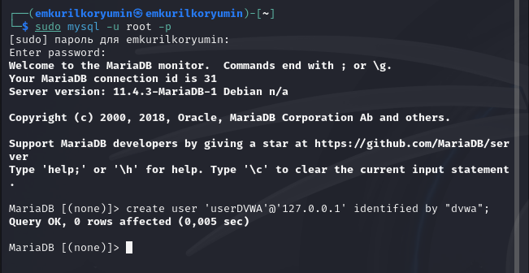

## 2.3

Теперь нужно пользователю предоставить привилегии для работы с этой базой данных

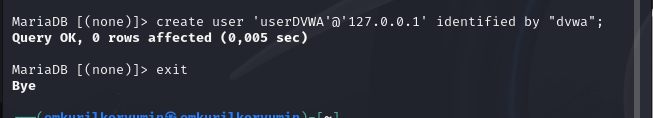

## 3.1

Необходимо настроить сервер apache2, перехожу в соответствующую директорию

## 3.2

В файле параметры allow_url_fopen и allow_url_include должны быть поставлены как `On` 

## 3.3

Запускаем службу веб-сервера apache и проверяем, запущена ли служба 

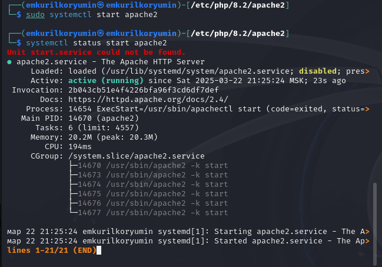

## 4.1

Мы настроили DVWA, Apache и базу данных, поэтому открываем браузер и запускаем веб-приложение, введя 127.0.0/DVWA 

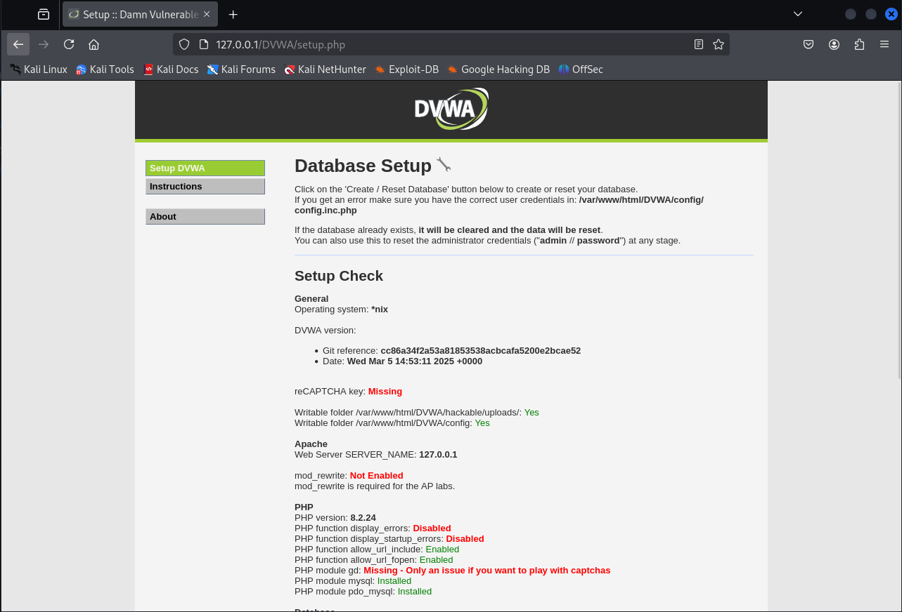

## 4.2

Прокручиваем страницу вниз и нажимем на кнопку `create\reset database`

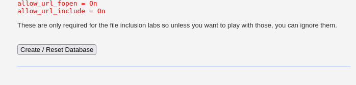

## 4.3

Авторизуюсь с помощью предложенных по умолчанию данных 

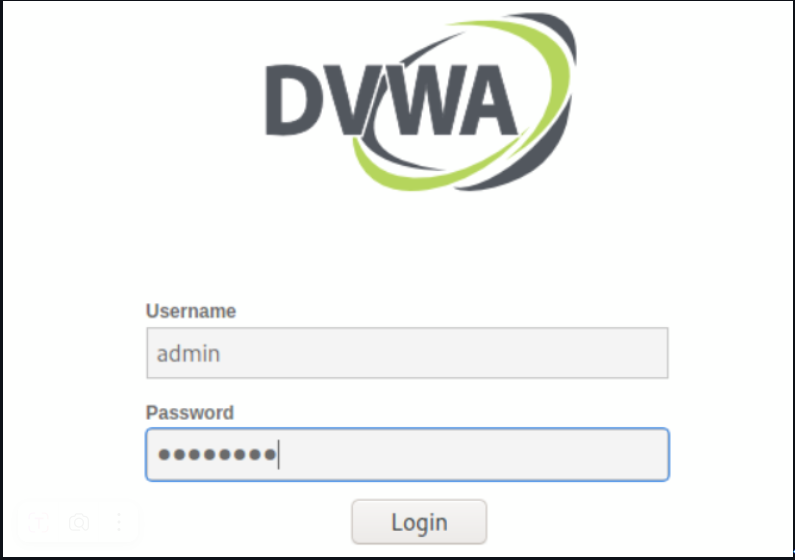

## 4.4

Оказываюсь на домшней странице веб-приложения, на этом установка окончена 

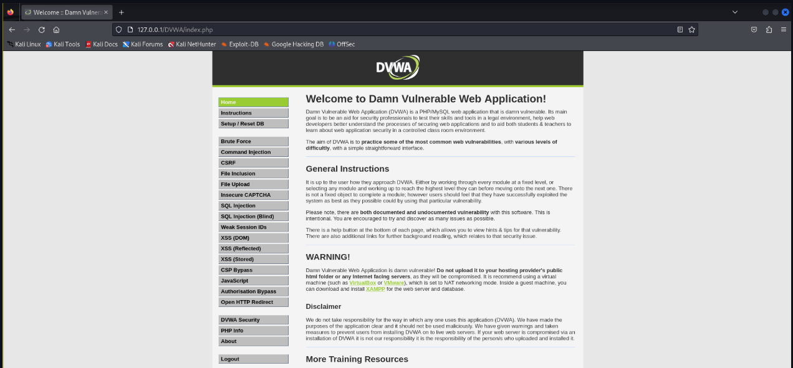

## Вывод

Приобрел практические навыки по установке уязвимого веб-приложения DVWA.

# Спасибо за внимание

:::